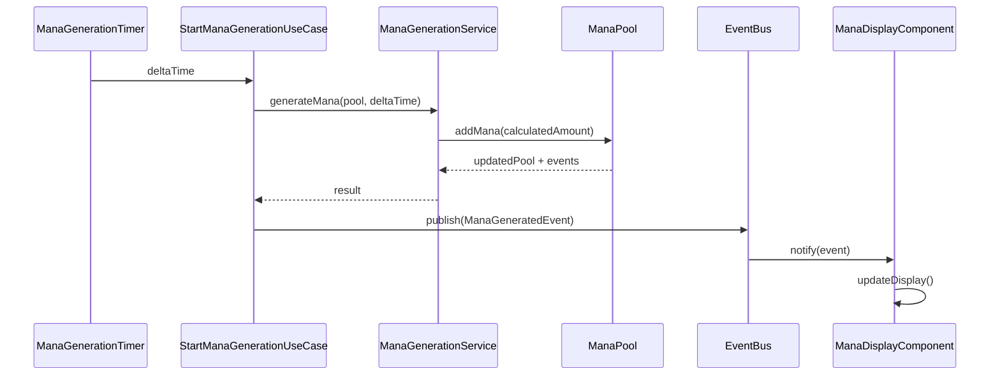
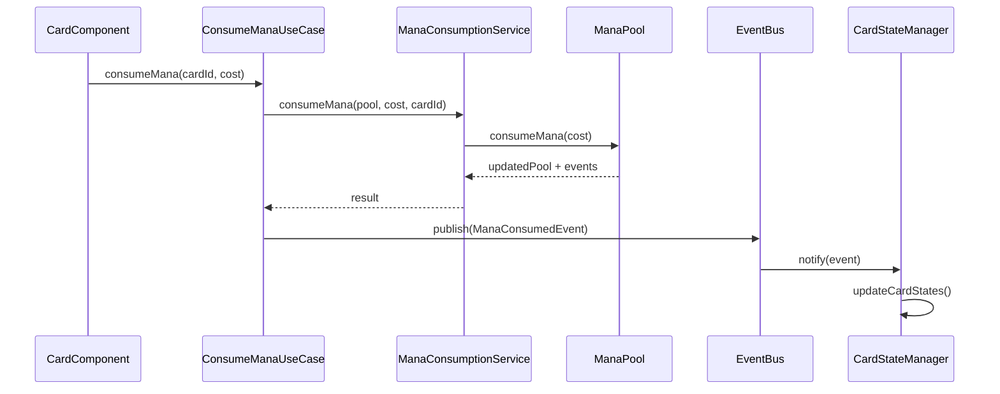

# 魔力システム管理ユニット - コンポーネントモデル設計

## 概要

魔力システム管理ユニットは、2Dタワーディフェンス×カードゲームにおける魔力（マナ）の生成、消費、状態管理を担当する。ハイブリッド方式のタイマーを採用し、ゲーム一時停止機能と連動する時間ベース魔力生成システムを実現する。

## アーキテクチャ概要

### 設計原則
- **ドメイン駆動設計（DDD）**: ビジネスロジックをドメインレイヤーに集約
- **単一責任の原則**: 各コンポーネントは明確に定義された責任を持つ
- **疎結合**: イベント駆動アーキテクチャによる疎結合な設計
- **テスト駆動開発（TDD）**: テスタブルな設計とインターフェース

### レイヤー構成
```
┌─────────────────────────────────────┐
│        プレゼンテーション層          │
│  (ManaDisplayComponent, CardUI)     │
├─────────────────────────────────────┤
│         アプリケーション層           │
│    (UseCases, EventHandlers)        │
├─────────────────────────────────────┤
│           ドメイン層                │
│  (ManaPool, ManaServices, Events)   │
├─────────────────────────────────────┤
│        インフラストラクチャ層        │
│   (Timer, EventBus, Repository)     │
└─────────────────────────────────────┘
```

## ドメインモデル

### 1. ManaPool（魔力プール）エンティティ

**責任**: 魔力の状態と基本的な操作を管理

```typescript
interface ManaPool {
  readonly id: string;
  readonly currentMana: number;
  readonly maxMana: number;
  readonly regenRate: number; // 秒あたりの回復量
  
  // ドメインメソッド
  addMana(amount: number): ManaPool;
  consumeMana(amount: number): ManaPool;
  canConsume(amount: number): boolean;
  isFull(): boolean;
  isEmpty(): boolean;
}
```

**不変条件**:
- `0 <= currentMana <= maxMana`
- `regenRate > 0`
- `maxMana > 0`

### 2. ManaTransaction（魔力取引）バリューオブジェクト

**責任**: 魔力の変更操作を表現

```typescript
interface ManaTransaction {
  readonly amount: number;
  readonly type: 'GENERATION' | 'CONSUMPTION';
  readonly timestamp: Date;
  readonly reason: string;
}
```

### 3. ドメインイベント

```typescript
// 魔力生成イベント
interface ManaGeneratedEvent {
  readonly type: 'MANA_GENERATED';
  readonly manaPoolId: string;
  readonly amount: number;
  readonly currentMana: number;
  readonly timestamp: Date;
}

// 魔力消費イベント
interface ManaConsumedEvent {
  readonly type: 'MANA_CONSUMED';
  readonly manaPoolId: string;
  readonly amount: number;
  readonly currentMana: number;
  readonly cardId: string;
  readonly timestamp: Date;
}

// 魔力上限到達イベント
interface ManaCapReachedEvent {
  readonly type: 'MANA_CAP_REACHED';
  readonly manaPoolId: string;
  readonly maxMana: number;
  readonly timestamp: Date;
}
```

## ドメインサービス

### 1. ManaGenerationService

**責任**: 魔力生成のビジネスロジック

```typescript
interface ManaGenerationService {
  generateMana(
    manaPool: ManaPool, 
    deltaTime: number
  ): {
    updatedPool: ManaPool;
    events: DomainEvent[];
  };
  
  calculateManaGeneration(
    regenRate: number, 
    deltaTime: number
  ): number;
}
```

### 2. ManaConsumptionService

**責任**: 魔力消費のビジネスロジック

```typescript
interface ManaConsumptionService {
  consumeMana(
    manaPool: ManaPool, 
    amount: number, 
    cardId: string
  ): {
    updatedPool: ManaPool;
    events: DomainEvent[];
    success: boolean;
  };
  
  validateConsumption(
    manaPool: ManaPool, 
    amount: number
  ): ValidationResult;
}
```

### 3. ManaValidationService

**責任**: 魔力関連の検証ロジック

```typescript
interface ManaValidationService {
  validateManaPool(manaPool: ManaPool): ValidationResult;
  validateTransaction(transaction: ManaTransaction): ValidationResult;
  validateCardCost(cardId: string, cost: number): ValidationResult;
}
```

## アプリケーションサービス

### 1. StartManaGenerationUseCase

**責任**: 魔力生成の開始処理

```typescript
interface StartManaGenerationUseCase {
  execute(request: StartManaGenerationRequest): Promise<void>;
}

interface StartManaGenerationRequest {
  readonly gameSessionId: string;
  readonly initialMana: number;
  readonly maxMana: number;
  readonly regenRate: number;
}
```

### 2. ConsumeManaUseCase

**責任**: 魔力消費の処理

```typescript
interface ConsumeManaUseCase {
  execute(request: ConsumeManaRequest): Promise<ConsumeManaResponse>;
}

interface ConsumeManaRequest {
  readonly gameSessionId: string;
  readonly cardId: string;
  readonly manaCost: number;
}

interface ConsumeManaResponse {
  readonly success: boolean;
  readonly currentMana: number;
  readonly errorMessage?: string;
}
```

### 3. GetManaStatusUseCase

**責任**: 魔力状態の取得

```typescript
interface GetManaStatusUseCase {
  execute(request: GetManaStatusRequest): Promise<ManaStatusResponse>;
}

interface GetManaStatusRequest {
  readonly gameSessionId: string;
}

interface ManaStatusResponse {
  readonly currentMana: number;
  readonly maxMana: number;
  readonly regenRate: number;
  readonly isGenerating: boolean;
}
```

## インフラストラクチャ層

### 1. ManaGenerationTimer（ハイブリッドタイマー）

**責任**: 高精度な魔力生成タイマーの実装

```typescript
interface ManaGenerationTimer {
  start(callback: (deltaTime: number) => void): void;
  pause(): void;
  resume(): void;
  stop(): void;
  isRunning(): boolean;
}

class HybridManaTimer implements ManaGenerationTimer {
  private readonly updateInterval = 100; // ms
  private intervalId: number | null = null;
  private lastUpdateTime = 0;
  private isPaused = false;
  
  start(callback: (deltaTime: number) => void): void {
    this.lastUpdateTime = Date.now();
    this.intervalId = setInterval(() => {
      if (this.isPaused) return;
      
      const currentTime = Date.now();
      const deltaTime = currentTime - this.lastUpdateTime;
      
      callback(deltaTime);
      this.lastUpdateTime = currentTime;
    }, this.updateInterval);
  }
  
  pause(): void {
    this.isPaused = true;
  }
  
  resume(): void {
    this.isPaused = false;
    this.lastUpdateTime = Date.now(); // 重要：再開時に時間をリセット
  }
  
  stop(): void {
    if (this.intervalId) {
      clearInterval(this.intervalId);
      this.intervalId = null;
    }
    this.isPaused = false;
  }
}
```

### 2. ManaPoolRepository

**責任**: 魔力プールの永続化（メモリベース）

```typescript
interface ManaPoolRepository {
  save(manaPool: ManaPool): Promise<void>;
  findByGameSessionId(gameSessionId: string): Promise<ManaPool | null>;
  delete(gameSessionId: string): Promise<void>;
}

class InMemoryManaPoolRepository implements ManaPoolRepository {
  private readonly pools = new Map<string, ManaPool>();
  
  async save(manaPool: ManaPool): Promise<void> {
    this.pools.set(manaPool.id, manaPool);
  }
  
  async findByGameSessionId(gameSessionId: string): Promise<ManaPool | null> {
    return this.pools.get(gameSessionId) || null;
  }
  
  async delete(gameSessionId: string): Promise<void> {
    this.pools.delete(gameSessionId);
  }
}
```

### 3. EventBus

**責任**: ドメインイベントの配信

```typescript
interface EventBus {
  publish(event: DomainEvent): void;
  subscribe<T extends DomainEvent>(
    eventType: string, 
    handler: (event: T) => void
  ): void;
  unsubscribe(eventType: string, handler: Function): void;
}
```

## プレゼンテーション層

### 1. ManaDisplayComponent

**責任**: 魔力値のリアルタイム表示

```typescript
interface ManaDisplayComponent {
  updateDisplay(currentMana: number, maxMana: number): void;
  showManaChange(amount: number, type: 'gain' | 'loss'): void;
  setVisible(visible: boolean): void;
}
```

### 2. CardStateManager

**責任**: カードの使用可能状態管理

```typescript
interface CardStateManager {
  updateCardStates(currentMana: number): void;
  setCardUsable(cardId: string, usable: boolean): void;
  getCardCost(cardId: string): number;
}
```

## コンポーネント間の相互作用

### 魔力生成フロー



### 魔力消費フロー



## エラーハンドリング

### 1. 魔力不足エラー

```typescript
class InsufficientManaError extends Error {
  constructor(
    public readonly required: number,
    public readonly available: number
  ) {
    super(`Insufficient mana: required ${required}, available ${available}`);
  }
}
```

### 2. タイマーエラー

```typescript
class TimerError extends Error {
  constructor(message: string, public readonly cause?: Error) {
    super(message);
  }
}
```

### 3. エラー処理戦略

- **魔力不足**: カードをグレーアウト表示、エラーメッセージなし
- **タイマー異常**: 自動復旧を試行、失敗時はゲーム一時停止
- **計算エラー**: デフォルト値にフォールバック、ログ出力

## パフォーマンス考慮事項

### 1. メモリ使用量最適化
- イミュータブルオブジェクトの効率的な実装
- イベント履歴の適切な管理（循環バッファ使用）
- 不要なオブジェクト生成の回避

### 2. CPU使用率最適化
- 100ms間隔での効率的な更新
- 魔力計算の最適化（浮動小数点演算の最小化）
- UI更新の間引き（値が変化した場合のみ更新）

### 3. 精度保証
- deltaTime計算による累積誤差の防止
- 魔力値の丸め処理の統一
- 長時間実行時の精度維持

## テスト戦略

### 1. 単体テスト
- ドメインエンティティの不変条件テスト
- ドメインサービスのビジネスロジックテスト
- タイマーの精度テスト

### 2. 統合テスト
- ユースケースの統合テスト
- イベントフローの検証
- UI更新の確認

### 3. パフォーマンステスト
- 3分間の連続動作テスト
- メモリリーク検出
- CPU使用率測定
- 精度検証（累積誤差1%以下）