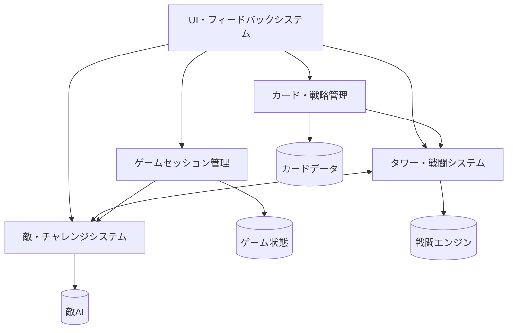

# 設計文書

## 概要

この文書は、タワーディフェンスカードゲームの技術的設計を定義します。AI-DLC手法に従い、ユーザーストーリーで定義された5つのユニットを基盤として、TypeScript + Bunを使用したモダンなWebアプリケーションアーキテクチャを採用します。

## アーキテクチャ

### 全体アーキテクチャ



### 技術スタック

- **言語**: TypeScript
- **ランタイム**: Bun
- **フロントエンド**: Canvas API (2D描画)
- **状態管理**: Reactive State Pattern
- **アーキテクチャパターン**: Clean Architecture + Domain-Driven Design
- **テスト**: Bun Test Framework

### レイヤー構成

```
┌─────────────────────────────────────┐
│           Presentation Layer        │
│  (UI Components, Event Handlers)    │
├─────────────────────────────────────┤
│          Application Layer          │
│     (Use Cases, Orchestration)      │
├─────────────────────────────────────┤
│            Domain Layer             │
│   (Business Logic, Entities)        │
├─────────────────────────────────────┤
│         Infrastructure Layer        │
│  (Data Access, External Services)   │
└─────────────────────────────────────┘
```

## コンポーネントと インターフェース

### ユニット1: ゲームセッション管理ユニット

#### ドメインモデル
```typescript
// Domain Entities
class GameSession {
  private sessionId: string;
  private startTime: Date;
  private duration: number; // 3分 = 180秒
  private playerHealth: number;
  private score: number;
  private status: GameStatus;

  start(): void;
  end(): GameResult;
  updateScore(points: number): void;
  takeDamage(damage: number): void;
  getRemainingTime(): number;
}

enum GameStatus {
  NOT_STARTED = 'not_started',
  PLAYING = 'playing',
  COMPLETED = 'completed',
  GAME_OVER = 'game_over'
}

interface GameResult {
  finalScore: number;
  survivedTime: number;
  enemiesDefeated: number;
  cardsUsed: number;
  status: GameStatus;
}
```

#### アプリケーションサービス
```typescript
class GameSessionService {
  startNewGame(): GameSession;
  endGame(sessionId: string): GameResult;
  updateGameState(sessionId: string, update: GameStateUpdate): void;
  getGameStatus(sessionId: string): GameStatus;
}
```

### ユニット2: カード・戦略管理ユニット

#### ドメインモデル
```typescript
// Value Objects
interface CardStats {
  cost: number;                // カードをプレイするのに必要なコスト
  damage: number;              // 生成されるタワーの攻撃力
  range: number;               // 生成されるタワーの射程距離
  attackSpeed: number;         // 生成されるタワーの攻撃速度
  maxHealth: number;           // 生成されるタワーの最大耐久値
}

interface CardTraits {
  powerfulButSlow: boolean;
  highDamageButFragile: boolean;
  fastButWeakDamage: boolean;
  specialAbilities: string[];
}

// Entities
class Card {
  readonly id: string;
  readonly name: string;
  readonly type: CardType;
  readonly stats: CardStats;
  readonly traits: CardTraits;
  readonly description: string;

  canBePlayed(gameState: GameState): boolean;
  createTower(): Tower;
}

class Hand {
  private cards: Card[];
  
  addCard(card: Card): void;
  removeCard(cardId: string): Card;
  getPlayableCards(gameState: GameState): Card[];
}

enum CardType {
  BASIC_TOWER = 'basic_tower',
  SNIPER_TOWER = 'sniper_tower',
  RAPID_FIRE = 'rapid_fire',
  SPLASH_DAMAGE = 'splash_damage',
  SUPPORT_TOWER = 'support_tower'
}
```

#### リポジトリ
```typescript
interface CardRepository {
  getAllCards(): Card[];
  getCardById(id: string): Card | null;
  getRandomCards(count: number): Card[];
}
```

### ユニット3: タワー・戦闘システムユニット

#### ドメインモデル
```typescript
// Entities
class Tower {
  readonly id: string;
  readonly position: Position;
  readonly stats: TowerStats;
  readonly traits: TowerTraits;
  private currentTarget: Enemy | null;
  private lastAttackTime: number;
  private activationTime: number;

  canAttack(): boolean;
  findTarget(enemies: Enemy[]): Enemy | null;
  attack(target: Enemy): AttackResult;
  isInRange(enemy: Enemy): boolean;
  isActivated(): boolean;
  
  // 耐久値管理
  takeDamage(damage: number): boolean;  // ダメージを受ける、破壊されたらtrue
  heal(amount: number): void;           // 耐久値を回復
  getHealthPercentage(): number;        // 耐久値の割合（0-1）
  isDestroyed(): boolean;               // 破壊されているかチェック
}

interface TowerStats {
  damage: number;              // 1回の攻撃で与えるダメージ量
  range: number;               // 攻撃可能な射程距離（ピクセル単位）
  attackSpeed: number;         // 1秒間の攻撃回数（attacks per second）
  maxHealth: number;           // タワーの最大耐久値
  currentHealth: number;       // タワーの現在耐久値（近接攻撃で減少）
  activationDelay: number;     // 配置後に攻撃可能になるまでの時間（秒）
}

interface TowerTraits {
  vulnerableToMelee: boolean;    // 近接攻撃に対して脆弱
  splashDamage: boolean;         // 範囲ダメージ（爆発系）
  piercing: boolean;             // 貫通攻撃（複数の敵を一度に攻撃）
  slowsEnemies: boolean;         // 敵の移動速度を減少させる
  selfHealing: boolean;          // 時間経過で自動回復
  regenerationRate: number;      // 1秒間の回復量（selfHealingがtrueの場合）
}

// Value Objects
interface Position {
  x: number;
  y: number;
}

interface AttackResult {
  damage: number;
  hit: boolean;
  effects: AttackEffect[];
}

enum AttackEffect {
  SLOW = 'slow',
  STUN = 'stun',
  POISON = 'poison'
}
```

#### ドメインサービス
```typescript
class BattleEngine {
  processCombat(towers: Tower[], enemies: Enemy[]): CombatResult;
  calculateDamage(tower: Tower, enemy: Enemy): number;
  applyTargetingStrategy(tower: Tower, enemies: Enemy[]): Enemy | null;
  
  // 貫通攻撃の処理：一直線上の複数敵にダメージ
  processPiercingAttack(tower: Tower, enemies: Enemy[]): AttackResult[];
  
  // 範囲攻撃の処理：爆発範囲内の敵にダメージ
  processSplashAttack(tower: Tower, epicenter: Position, enemies: Enemy[]): AttackResult[];
}

interface CombatResult {
  defeatedEnemies: Enemy[];
  damagedTowers: Tower[];
  scoreGained: number;
}
```

### ユニット4: 敵・チャレンジシステムユニット

#### ドメインモデル
```typescript
// Entities
class Enemy {
  readonly id: string;
  readonly type: EnemyType;
  private health: number;
  private maxHealth: number;
  private position: Position;
  private speed: number;
  private pathIndex: number;

  move(deltaTime: number, path: Position[]): void;
  takeDamage(damage: number): boolean; // returns true if defeated
  isAtBase(): boolean;
  getDistanceToBase(): number;
}

class Wave {
  readonly waveNumber: number;
  private enemies: Enemy[];
  private spawnDelay: number;
  private lastSpawnTime: number;

  spawnNext(): Enemy | null;
  isComplete(): boolean;
  getRemainingEnemies(): number;
}

enum EnemyType {
  BASIC = 'basic',
  FAST = 'fast',
  HEAVY = 'heavy',
  FLYING = 'flying',
  BOSS = 'boss'
}
```

#### ドメインサービス
```typescript
class WaveGenerator {
  generateWave(waveNumber: number, gameTime: number): Wave;
  calculateDifficulty(waveNumber: number): DifficultySettings;
}

interface DifficultySettings {
  enemyCount: number;
  enemyTypes: EnemyType[];
  healthMultiplier: number;
  speedMultiplier: number;
}

class PathfindingService {
  getPath(): Position[];
  calculateDistance(from: Position, to: Position): number;
}
```

### ユニット5: UI・フィードバックシステムユニット

#### プレゼンテーション層
```typescript
// UI Components
class GameCanvas {
  private ctx: CanvasRenderingContext2D;
  private layers: RenderLayer[];

  render(gameState: GameState): void;
  handleClick(position: Position): void;
  handleCardDrag(card: Card, position: Position): void;
}

class UIManager {
  private hudElements: HUDElement[];
  private effectsManager: EffectsManager;

  updateHUD(gameState: GameState): void;
  showCardDetails(card: Card): void;
  displayGameResult(result: GameResult): void;
}

// Effects and Animations
class EffectsManager {
  playAttackEffect(from: Position, to: Position): void;
  playExplosionEffect(position: Position): void;
  playTowerPlacementEffect(position: Position): void;
  playScoreEffect(position: Position, score: number): void;
}

class AudioManager {
  playSound(soundId: string): void;
  playMusic(musicId: string): void;
  setVolume(volume: number): void;
}
```

## データモデル

### ゲーム設定データ
```typescript
interface GameConfig {
  sessionDuration: number; // 180 seconds
  playerStartingHealth: number; // 20
  baseScore: number; // 0
  maxHandSize: number; // 8
  cardPoolSize: number; // 30+
}

interface MapConfig {
  width: number;
  height: number;
  path: Position[];
  towerSlots: Position[];
  basePosition: Position;
}
```

### 永続化データ
```typescript
interface GameSave {
  sessionId: string;
  timestamp: Date;
  gameState: GameState;
  playerStats: PlayerStats;
}

interface PlayerStats {
  gamesPlayed: number;
  highScore: number;
  totalEnemiesDefeated: number;
  favoriteCards: string[];
  unlockedCards: string[];
}
```

## エラーハンドリング

### エラー分類
```typescript
abstract class GameError extends Error {
  abstract readonly code: string;
  abstract readonly severity: ErrorSeverity;
}

class InvalidCardPlayError extends GameError {
  readonly code = 'INVALID_CARD_PLAY';
  readonly severity = ErrorSeverity.WARNING;
}

class GameStateCorruptionError extends GameError {
  readonly code = 'GAME_STATE_CORRUPTION';
  readonly severity = ErrorSeverity.CRITICAL;
}

enum ErrorSeverity {
  INFO = 'info',
  WARNING = 'warning',
  ERROR = 'error',
  CRITICAL = 'critical'
}
```

### エラー処理戦略
1. **ユーザー入力エラー**: UI上で即座にフィードバック
2. **ゲームロジックエラー**: ログ記録 + 安全な状態に復旧
3. **システムエラー**: エラー画面表示 + 自動再起動

## テスト戦略

### テストピラミッド
```
    ┌─────────────────┐
    │   E2E Tests     │  ← ゲーム全体のフロー
    │   (少数)        │
    ├─────────────────┤
    │ Integration     │  ← ユニット間の連携
    │ Tests (中程度)   │
    ├─────────────────┤
    │  Unit Tests     │  ← 個別ロジック
    │  (多数)         │
    └─────────────────┘
```

### テスト種別

#### ユニットテスト
- ドメインエンティティのビジネスロジック
- 計算ロジック（ダメージ、スコア、距離）
- 状態遷移ロジック

#### 統合テスト
- ユニット間のデータフロー
- イベント処理チェーン
- UI操作からドメインロジックまでの流れ

#### E2Eテスト
- 完全なゲームセッション
- カードプレイからゲーム終了まで
- エラーシナリオの処理

### テスト実装例
```typescript
// Unit Test Example
describe('Tower', () => {
  it('should attack enemy in range', () => {
    const tower = new Tower(towerConfig);
    const enemy = new Enemy(enemyConfig);
    
    const result = tower.attack(enemy);
    
    expect(result.hit).toBe(true);
    expect(result.damage).toBeGreaterThan(0);
  });
});

// Integration Test Example
describe('Card to Tower Conversion', () => {
  it('should create tower with correct stats from card', () => {
    const card = cardRepository.getCardById('sniper-tower');
    const tower = card.createTower();
    
    expect(tower.stats.range).toBe(card.stats.range);
    expect(tower.traits.vulnerableToMelee).toBe(card.traits.highDamageButFragile);
  });
});
```

## パフォーマンス考慮事項

### 最適化戦略

#### レンダリング最適化
- **Canvas レイヤー分離**: 静的要素と動的要素を分離
- **オブジェクトプーリング**: Enemy, Projectile オブジェクトの再利用
- **フレームレート制御**: 60FPS上限、必要に応じて30FPSに調整

#### メモリ管理
- **イベントリスナー**: 適切なクリーンアップ
- **タイマー管理**: setInterval/setTimeout の適切な解放
- **画像リソース**: プリロード + キャッシュ戦略

#### 計算最適化
- **衝突判定**: 空間分割による効率化
- **パスファインディング**: 事前計算 + キャッシュ
- **戦闘計算**: バッチ処理による最適化

### パフォーマンス指標
- **フレームレート**: 60FPS維持
- **メモリ使用量**: 100MB以下
- **初期ロード時間**: 3秒以内
- **ゲーム開始時間**: 1秒以内

## セキュリティ考慮事項

### クライアントサイドセキュリティ
- **入力検証**: すべてのユーザー入力の検証
- **状態整合性**: ゲーム状態の不正操作防止
- **リソース保護**: 画像・音声ファイルの適切な配信

### データ保護
- **ローカルストレージ**: 機密情報の非保存
- **セッション管理**: 適切なセッション無効化
- **エラー情報**: 機密情報の漏洩防止

## デプロイメント戦略

### ビルド設定
```typescript
// bun.config.ts
export default {
  entrypoints: ['./src/main.ts'],
  outdir: './dist',
  target: 'browser',
  minify: true,
  sourcemap: true,
  splitting: true
};
```

### コード品質設定
```json
// biome.json
{
  "formatter": {
    "enabled": true,
    "indentStyle": "space",
    "indentWidth": 2
  },
  "linter": {
    "enabled": true,
    "rules": {
      "recommended": true
    }
  },
  "javascript": {
    "formatter": {
      "semicolons": "always",
      "quoteStyle": "single"
    }
  }
}
```

### 環境設定
- **開発環境**: ホットリロード + デバッグ情報
- **テスト環境**: 自動テスト実行 + カバレッジ
- **本番環境**: 最適化ビルド + 監視

### CI/CD パイプライン
1. **コード品質チェック**: Biome (フォーマット + リント)
2. **テスト実行**: Unit + Integration + E2E
3. **ビルド**: 最適化されたバンドル生成
4. **デプロイ**: 静的ファイル配信

## 監視とログ

### ログ戦略
```typescript
enum LogLevel {
  DEBUG = 'debug',
  INFO = 'info',
  WARN = 'warn',
  ERROR = 'error'
}

class Logger {
  log(level: LogLevel, message: string, context?: any): void;
  logGameEvent(event: GameEvent): void;
  logPerformanceMetric(metric: PerformanceMetric): void;
}
```

### 監視項目
- **ゲームセッション**: 開始/終了/中断率
- **パフォーマンス**: FPS, メモリ使用量, ロード時間
- **エラー**: エラー発生率, エラー種別
- **ユーザー行動**: カード使用頻度, プレイ時間

## 拡張性設計

### 将来の機能拡張
- **新カードタイプ**: プラグイン形式での追加
- **新敵タイプ**: 設定ファイルでの定義
- **新マップ**: JSON設定での追加
- **マルチプレイヤー**: WebSocket対応準備

### モジュール設計
```typescript
interface GameModule {
  initialize(): Promise<void>;
  cleanup(): Promise<void>;
  getVersion(): string;
}

class ModuleManager {
  loadModule(module: GameModule): Promise<void>;
  unloadModule(moduleId: string): Promise<void>;
  getLoadedModules(): GameModule[];
}
```

## 次のステップ

この設計文書に基づいて、以下の順序で実装を進めることを推奨します：

1. **ドメインモデル実装** - 各ユニットのコアロジック
2. **基本UI実装** - Canvas描画とイベント処理
3. **ゲームループ実装** - メインゲームサイクル
4. **統合テスト** - ユニット間の連携確認
5. **最適化とポリッシュ** - パフォーマンス調整と UX改善

各段階で適切なテストを実装し、継続的な品質保証を行います。